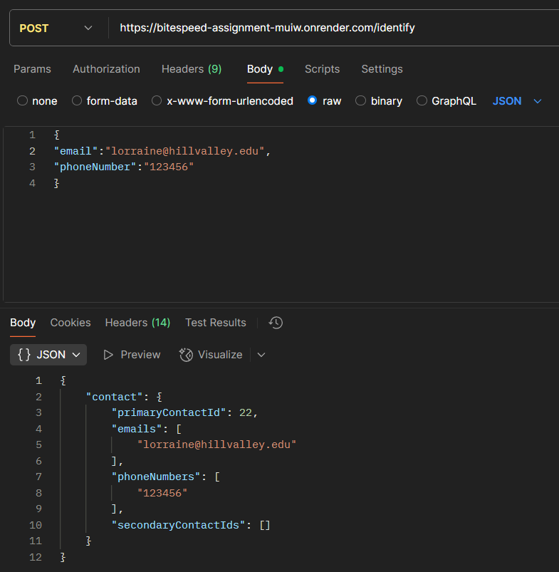
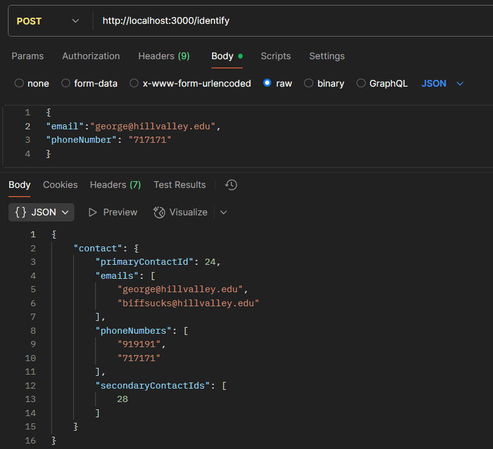
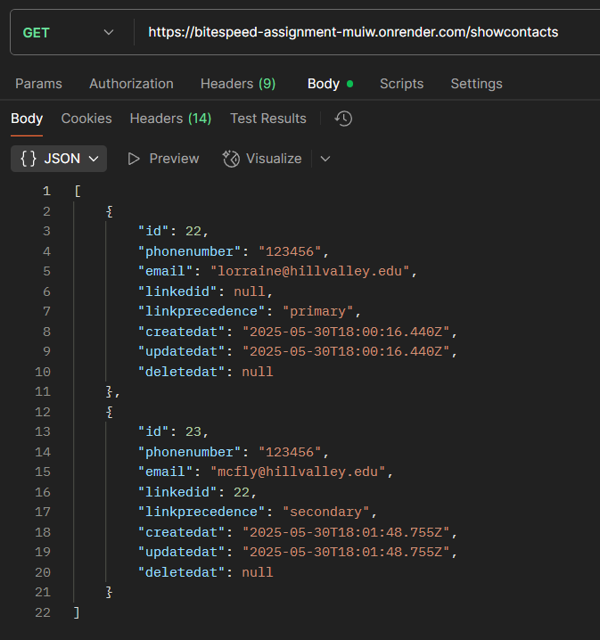
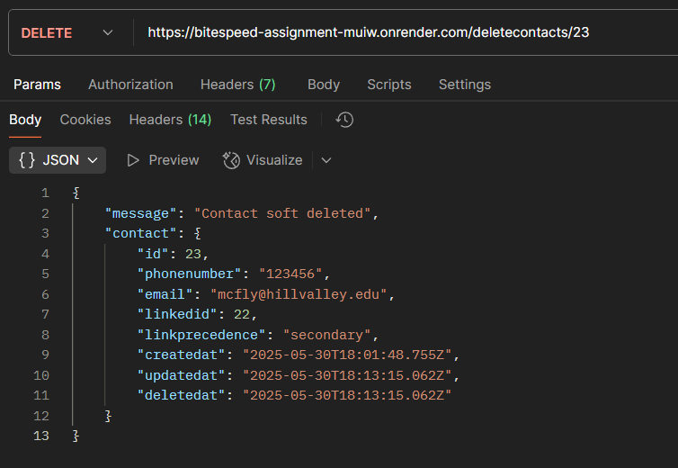

# Bitespeed Identity Reconciliation API

Here are the **endpoints** created for better understandings:

Base URL: https://bitespeed-assignment-muiw.onrender.com

identify: https://bitespeed-assignment-muiw.onrender.com/identify

view all data: https://bitespeed-assignment-muiw.onrender.com/showcontacts

delete a data: https://bitespeed-assignment-muiw.onrender.com/deletecontacts/:id

Use data formats as JSON for sending request as:

{

    "email": email

    "phoneNumber": phoneNumber
    
}

